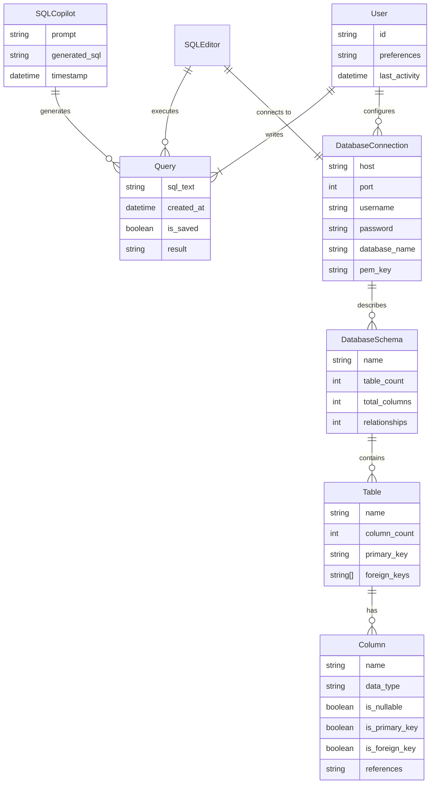

# SQL Editor with AI

This project is a **SQL Editor with AI Assistance**, built using **React** and **Vite**. It provides a user-friendly interface for writing, executing, and formatting SQL queries. Additionally, it includes an AI-powered SQL Copilot to assist users in generating SQL queries based on natural language prompts.

## Features

1. **SQL Editor**:

   - Write SQL queries in a Monaco-based editor with syntax highlighting.
   - Format SQL queries using the `sql-formatter` library.
   - Upload `.sql` files and save queries to `.sql` files.

2. **Query Execution**:

   - Execute predefined SQL queries and view results in a tabular format.
   - Mock query results are displayed for predefined queries.

3. **Database Explorer**:

   - Visualize database schemas, including tables, columns, and relationships.
   - Search for tables and columns within the schema.
   - View detailed statistics for databases and tables.

4. **SQL Copilot**:

   - AI-powered assistant for generating SQL queries from natural language prompts.
   - Uses **Google Generative AI (Gemini)** for query generation.
   - Displays a chat-like interface for user interaction.

5. **Dark Mode**:

   - Toggle between light and dark themes for better usability.

6. **Database Connection**:

   - Configure database connection settings (e.g., host, port, username, password).
   - Upload PEM keys for secure SSH connections.

7. **Responsive Design**:
   - The app is designed to work seamlessly across different screen sizes.

---

## File Structure and Responsibilities

### Root Files

- **`.env`**: Environment variables for sensitive data like API keys {VITE_API_KEY=xyz-gemini-api-key}.
- **`.gitignore`**: Specifies files and directories to be ignored by Git.
- **`Atlan Frontend Internship Task 2025.pdf`**: A PDF document, possibly containing task details.
- **`command.txt`**: Contains predefined SQL queries and their descriptions.
- **`eslint.config.js`**: ESLint configuration for maintaining code quality.
- **`index.html`**: The entry point for the app, linking the React app to the DOM.
- **`package.json`**: Defines project dependencies, scripts, and metadata.
- **`README.md`**: Documentation for the project.
- **`vite.config.js`**: Configuration for the Vite build tool.

---

### Public Folder

- **`vite.svg`**: The favicon for the app.

---

### `src` Folder

#### `App.jsx`

- The root component that renders the main layout of the app.

#### `main.jsx`

- The entry point for the React app, rendering the `App` component into the DOM.

#### `index.css`

- Global styles for the app, including scrollbar customization and font imports.

#### `App.css`

- Additional styles specific to the `App` component.

---

### `src/assets` Folder

- **`orders.csv`**: A mock dataset representing orders, used for predefined queries.
- **`react.svg`**: A React logo, possibly used in the UI.

---

### `src/component` Folder

#### `MainLayout.jsx`

- The main layout of the app, organizing the header, SQL editor, database explorer, and SQL Copilot.

#### `Header.jsx`

- Displays the app's header with options for database connection, settings, and dark mode toggle.

#### `DatabaseExplorer.jsx`

- Visualizes the database schema and allows users to search and view details about tables and columns.

#### `SQLEditor.jsx`

- Provides a Monaco-based SQL editor for writing, formatting, and executing queries.
- Handles file upload and download for `.sql` files.

#### `SQLCopilot.jsx`

- Implements the AI-powered SQL assistant using Google Generative AI.
- Displays a chat interface for user interaction.

#### `styles.css`

- Contains styles for various components, including buttons, the SQL editor, and the SQL Copilot.

---

### `src/context` Folder

#### `SQLEditorContext.jsx`

- Provides a React context for managing the state of the SQL editor (e.g., the current query).

---

## ER Diagram



The ER diagram above illustrates the relationships between different components of the SQL Editor application:

- **SQLEditor**: The main component that handles query execution
- **DatabaseConnection**: Manages database connectivity settings
- **DatabaseSchema**: Represents the structure of the connected database
- **Table**: Database tables with their properties
- **Column**: Individual columns within tables
- **Query**: SQL queries written or generated
- **User**: Application users and their preferences
- **SQLCopilot**: AI component for query generation

Key Relationships:

- SQLEditor executes multiple Queries
- Each DatabaseConnection describes one or more DatabaseSchemas
- Each DatabaseSchema contains multiple Tables
- Each Table has multiple Columns
- SQLCopilot can generate multiple Queries
- Users can write multiple Queries and configure multiple DatabaseConnections

---

## How to Run the Project

1. **Install Dependencies**:

   ```bash
   npm install
   ```

   ```bash
   npm run dev
   ```

Predefined query :

```bash
SELECT * FROM orders LIMIT 10;
SELECT COUNT(*) as total_orders, shipCountry FROM orders GROUP BY shipCountry ORDER BY total_orders DESC LIMIT 5;
SELECT customerID, COUNT(*) as order_count FROM orders GROUP BY customerID ORDER BY order_count DESC LIMIT 5;
SELECT YEAR(orderDate) as year, COUNT(*) as orders FROM orders GROUP BY year ORDER BY year;
SELECT shipCity, COUNT(*) as orders FROM orders WHERE shipCountry = 'USA' GROUP BY shipCity ORDER BY orders DESC LIMIT 5;
```
